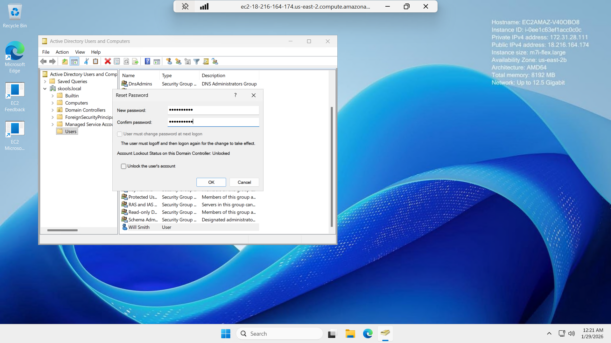
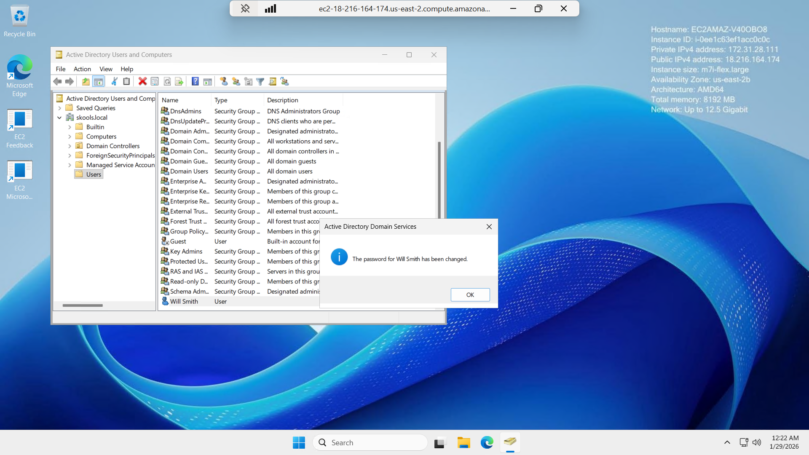

# Active-Directory-User-Password-Reset
Practice resetting passwords and managing account lockouts in Active Directory

**Watch me build this lab here!** [**Watch me build this lab here!**](https://www.loom.com/share/e68e166e65bc459aaa907bcc4ae06e1b)

Practice resetting passwords and managing account lockouts in Active Directory.

---

## 🔐 Active Directory - Password Reset Lab

### 🧩 Objective
Practice resetting passwords and managing account lockouts in Active Directory by identifying an impacted user account, performing a password reset, confirming the result, and reviewing policy expectations.

### 🧠 Skills Practiced
- Resetting user passwords  
- Unlocking user accounts (when applicable)  
- Following password policy expectations  
- Verifying account access after changes  
- Documenting support actions clearly (helpdesk-style)

### 🧰 Tools Used
- Windows Server (Domain Controller)  
- Active Directory Users and Computers (ADUC)

---

## 🪜 Steps Performed

### Step 1 — Locate the affected user account
- Open **Active Directory Users and Computers (ADUC)**
- Navigate to the correct OU (ex: **Users**)
- Identify the user who is locked out / password expired / unable to log in

---

### Step 2 — Reset the user password in ADUC
- Right-click the user → **Reset Password**
- Enter a strong temporary password
- (Optional) Check **User must change password at next logon** if your policy requires it
- Confirm and apply the change

---

### Step 3 — Confirm the password reset succeeded
- Verify you receive a success confirmation
- Confirm the account is no longer locked (if lockout was part of the issue)
- Ensure the user can sign in using the new password (or proceed with next-logon change)

---

### Step 4 — Review password policy settings (text-only)
- Review domain password policy expectations (ex: minimum length, complexity, lockout threshold)
- Confirm your reset workflow aligns with policy and support procedures

---

## ✅ Outcome
Demonstrated the ability to reset passwords, address common login issues (lockouts/expired credentials), and validate successful resolution within an Active Directory domain environment.
